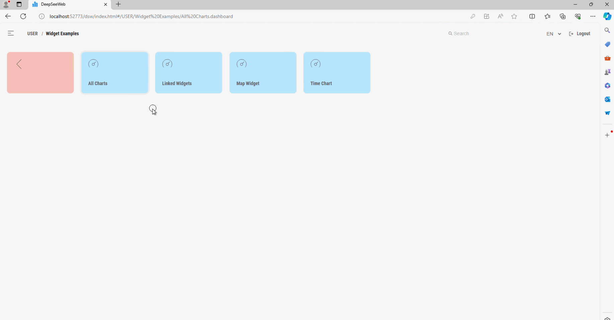
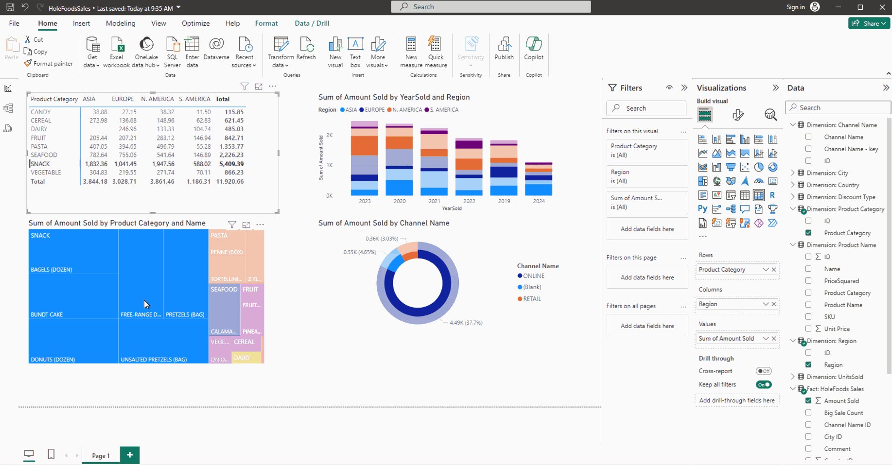

Intro to Analytics using InterSystems BI feature in InterSystems IRIS. You can find more information in the [documentation](https://docs.intersystems.com/irislatest/csp/docbook/DocBook.UI.Page.cls?KEY=PAGE_bi)

# Setup
Build image
```
docker compose build
```

Run container
```
docker compose up -d
```

# Overview
## Pareto Chart for Product and Category
* Go to [Management Portal](http://localhost:52773/csp/sys/UtilHome.csp)
* Go to *Analytics > USER namespace > User Portal*  and open **Pareto Chart for Product and Category** dashboard.
* Change some filters. Widgets are linked.
* Go back clicking on **Home** link.

## Drill options
* Go to *Analytics > USER namespace > User Portal*  and open **Drill options** dashboard.
* Drill-down through data.
* Go back clicking on **Home** link.

## Date filter demo
* Go to *Analytics > USER namespace > User Portal*  and open **Date filter demo** dashboard.
* Change filters and chart type.
* Click on *Show detail listing* button to list the actual fact tables that have been computed for a cell value.

## Analyzer
* Go back to [Management Portal](http://localhost:52773/csp/sys/UtilHome.csp) or click on *Menu > Management Portal*. 
* Go to *Analytics > USER namespace > Analyzer*
* Cube: "HoleFoods Sales"
* Drag & drop "Product" into Rows.
* Drag & drop "Region" into Columns.
* Drag & drop "Product Name" into "Product Category"
* Try some quick graphical representation.
* Include "Revenue" measure.
* Click on one cell and get the detailed listing.

## Architect
* Go back to [Management Portal](http://localhost:52773/csp/sys/UtilHome.csp)
* Go to *Analytics > USER namespace > Architect*.
* Click Open > *HoleFoods Sales* Cube.
* Have a look at the **Source Class**
* Review different defined dimensions, measures and listings.
* You could re-build the whole cube if you want from here.
* In the *Tools* tab you can access to *Analyzer* tool.
* In VS Code, open the source class.
* In *Explorer > SQL* run a query to see the contents of the source class.
```
select * from HoleFoods.SalesTransaction
```

## Add new data and synchronize
* In a [WebTerminal](http://localhost:52773/terminal/) session, add some new additional rows:
```
do ##class(HoleFoods.Utils).AddData(1000,1,1)
```
* Check in *Explorer > SQL* the number of rows
* Check in *Analytics > Analyzer* the actual number of records.
* Instead a full cube build you are going to synchronize only the new data, run:
```
do ##class(%DeepSee.Utils).%SynchronizeCube("HoleFoods")
```
* Check again in *Analytics > Analyzer* the number of records after the synchronization.


# Creating a simple dashboard
You will create a simple MDX query (pivot table) and then use some widget in a dashboard to represent it.

## Create a pivot table
* Go to [Management Portal](http://localhost:52773/csp/sys/UtilHome.csp) or click on *Menu > Management Portal*. 
* Go to *Analytics > USER namespace > Analyzer*
* Select "HoleFoods Sales" Cube.
* Click "New"
* Drag & drop "Product Category" into Rows.
* Drag & drop "Date of Sale" into Columns.
* Drag & drop "Units Sold" into "Measures"
* Click "Save"
  * Folder: Workshop
  * Pivot Name: "UnitsSoldbyDate"
  * Category: Workshop
  * Public: true
* Go to [Management Portal](http://localhost:52773/csp/sys/UtilHome.csp) > Analytics > USER namespace > User Portal
* Check that your Pivot appears now on "Workshop" section
* Click on the cover, and figure out how to change the appearance using the book icon.

## Create a dashboard from your pivot
* Go to [Management Portal](http://localhost:52773/csp/sys/UtilHome.csp) > Analytics > USER namespace > User Portal
* Click on the plus icon on the top > Add Dashboard
  * Folder: Workshop
  * Dashboard name: UnitsSold
  * Dashboard title: Units Sold over the years
  * Category: Workshop
  * Public: true
* Click on the left menu
* Widgets > Add Widget > Stacked bar chart > choose your pivot as data source
* Change the size of the widget
* Chart Settings > Colors & style > Caribbean
* Controls > Add
  * Location: Widget
  * Target: *
  * Action: Apply Filter
  * Filter: Region
* Save


# Business Intelligence REST API
## Try API using Postman
Have a look at the [Business Intelligence REST API](https://docs.intersystems.com/iris20221/csp/docbook/DocBook.UI.Page.cls?KEY=D2CLIENT_rest_api)
* In Postman, open [IRISBIRESTAPI.postman_collection.json](./IRISBIRESTAPI.postman_collection.json)
* Try different requests.

# Community package: DSW
## Check out DSW package
* Have a look at the Community Package [DSW](https://openexchange.intersystems.com/package/DeepSeeWeb)
* Go to http://localhost:52773/dsw/index.html#/USER and see it working with your own dashboard 



# Power BI
You can also use [InterSystems IRIS Connector for Power BI](https://docs.intersystems.com/irislatest/csp/docbook/DocBook.UI.Page.cls?KEY=APOWER).

If you have Power BI, have a look at the docs and  try the sample [HoleFoodsSales.pbix](./HoleFoodsSales.pbix)

